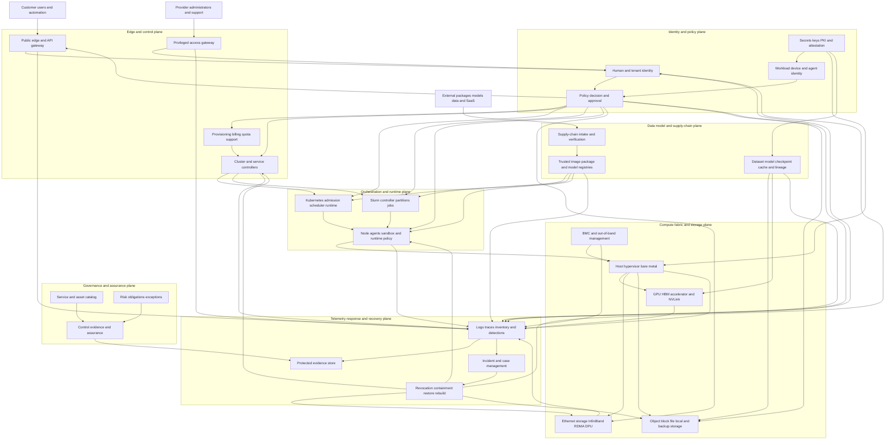

# NeoCloud Cyber Security Reference Architecture

**Version:** 1.0.0-draft.2  
**Audience:** security architecture, platform engineering, network, SRE, identity, data/AI, infrastructure, and assurance teams

## 1. Architectural intent

This reference architecture translates the white-paper principles into separable capabilities, trust zones, decision points, enforcement points, evidence flows, and recovery boundaries. It is vendor neutral. A NeoCloud may implement components differently, but it must preserve the security invariants and evidence outcomes. Read [Scope and Limitations](SCOPE_AND_LIMITATIONS.md) before treating a logical component as a product or a hardware-specific guarantee.

The architecture assumes that:

- public cloud-like APIs coexist with Kubernetes, Slurm/HPC, bare-metal automation and physical accelerator fabrics;
- a single tenant request crosses multiple controllers and representations before a workload executes;
- infrastructure, workload, data/model, and agent identities must remain correlated;
- tenant isolation is a property of the complete path, not an individual VLAN, namespace or GPU setting;
- administrative and automated actions can be as dangerous as hostile workload traffic;
- the evidence plane needs administrative and observational independence appropriate to risk; this is a logical trust requirement and does not always require separate physical infrastructure.

## 2. Logical architecture

The diagram represents logical authority, not a recommendation to centralize all runtime enforcement. Policy enforcement points should remain close to protected resources so a central outage does not silently fail open. Policy, identities, assets and evidence must use stable identifiers so an API request can be traced through scheduling, host/GPU/fabric allocation, data access, output and deletion.

## 3. Seven security planes

### 3.1 Governance and assurance plane

**Purpose:** decide what must be protected, who is accountable, which obligations apply, what risk is accepted, and whether controls are currently proven.

Minimum capabilities:

- product and security service catalog;
- asset, identity, dependency and data-flow graph;
- control catalog and service-profile applicability;
- obligation and customer-commitment register;
- risk and exception workflow with expiration;
- evidence inventory, freshness and integrity status;
- independent verification and assurance package generation;
- security roadmap, ownership and resource decisions.

This plane is the system of record for decision context, not necessarily the source of every technical event. It must distinguish `IMPLEMENTED` from `VERIFIED` and prevent expired evidence or exceptions from presenting as healthy.

### 3.2 Identity and policy plane

**Purpose:** establish the subject, resource, action, purpose and context for every material decision.

Subjects include provider staff, customer users, organizations, support roles, service accounts, workloads, nodes, devices, controllers, build systems, AI agents and security automation.

Minimum capabilities:

- enterprise and customer federation, phishing-resistant MFA and lifecycle automation;
- privileged access management, JIT/JEA and break-glass;
- short-lived workload identity rather than embedded secrets, with attestation binding where supported and justified by the threat model;
- device/node/BMC/DPU identity where technically possible;
- dedicated agent identity and explicit delegation chains;
- centralized policy authoring and decision with distributed enforcement;
- contextual attributes: tenant, service, environment, data class, region, device state, isolation SKU, ticket/purpose and risk;
- approval for destructive, customer-impacting, external, high-cost or irreversible actions;
- central secrets, key, certificate, signing and attestation lifecycle.

A policy decision should be explainable as:

`subject + delegation + action + resource + tenant + purpose + context + policy version → allow/deny/approve + obligations`

Obligations may require logging, masking, dual approval, restricted egress, dedicated placement, session recording, rate limit, data-residency enforcement, or post-action verification.

### 3.3 Edge and control plane

**Purpose:** expose customer services without exposing provider administration or allowing tenant confusion.

Minimum capabilities:

- DDoS protection, WAF/API gateway, schema and payload validation;
- tenant-correct object authorization at every API and controller hop;
- request IDs, idempotency, replay resistance, quotas and rate limits;
- private provider administration and a separately governed support path;
- signed/reviewed changes for provisioning, quota, billing, placement and network/fabric assignment;
- control-plane secrets and workload identities isolated from tenant workloads;
- high-availability controllers with secure backup and rebuild;
- complete audit of intent, decision, desired state, actual state and reconciliation errors.

An internal controller is not trusted merely because it is internal. Each transition between API objects, database records, Kubernetes resources, Slurm state and infrastructure controllers must preserve the tenant and authorization context.

### 3.4 Orchestration and runtime plane

**Purpose:** safely translate approved intent into running jobs and services.

For Kubernetes, this includes API server, etcd, controller manager, scheduler, admission, RBAC, namespaces, network policy, Pod Security Standards, runtime, CNI/CSI, device plugins and operators. For Slurm, it includes controller, database, REST API, authentication, partitions, accounts, QOS, prolog/epilog, modules, shared storage, compute daemons and job accounting.

Minimum capabilities:

- provider-only controllers and databases kept private; customer-facing API endpoints private by default or explicitly approved, strongly authenticated, restricted, abuse-protected, and audited;
- separate provider and tenant authority;
- default-deny admission for privileged, host, device and network access;
- immutable or tightly managed node images;
- signed and policy-approved workload artifacts;
- namespace/queue/account quotas and placement constraints;
- runtime detection and rapid node isolation;
- trusted job cleanup, credential revocation and artifact handling;
- control-plane backup, restore and known-good rebuild.

### 3.5 Compute, fabric and storage plane

**Purpose:** enforce the physical and logical tenant boundary where data is processed and moved.

Compute capabilities include secure boot/measured boot, trusted images, host hardening, hypervisor/container isolation, device assignment, GPU partitioning or dedication, memory reset, local-disk sanitation, error-domain containment and placement records.

Fabric capabilities include explicit separation of public, tenant, storage, cluster, migration, management and OOB planes; VRF/VPC/VLAN/VXLAN policy; InfiniBand P_Key and partition management; RDMA controls; DPU/NIC policy; NVLink domain awareness; network telemetry; and end-to-end reachability tests.

Storage capabilities include per-tenant authorization, encryption, key separation, snapshot/clone controls, lifecycle and retention, deletion verification, immutable backup, restore testing and tenant-safe metadata/logging.

BMC/OOB must be isolated from tenant and ordinary corporate networks, strongly authenticated, patched, monitored, and reachable only through privileged access workflows. A compromised BMC or fabric controller is a provider-root or fleet-impacting incident whose scope depends on the deployed authority and topology.

### 3.6 Data, model and supply-chain plane

**Purpose:** ensure that every executable or high-value artifact has known origin, authorized handling, integrity and lifecycle.

Minimum capabilities:

- approved source and dependency policy;
- isolated builds, protected signing identities and two-person release for roots/high-impact components;
- SBOM, provenance, signature and vulnerability/VEX evidence for images, packages, operators, drivers, firmware and infrastructure bundles;
- model, checkpoint, adapter, dataset, prompt, skill and policy inventory;
- safe model/artifact formats and restricted deserialization;
- malware, secret, license, integrity and policy scanning;
- trusted registries and admission-time verification;
- lineage from source/data to build/train/evaluate/release/deploy;
- recall, quarantine, revocation and rollback paths;
- privacy, residency, retention and deletion controls.

A signature proves that a key signed an artifact; it does not prove the artifact is safe. Trust depends on source, build, review, key custody, transparency, policy and validation together.

### 3.7 Telemetry, response and recovery plane

**Purpose:** produce reliable knowledge of state, detect material deviation, coordinate response, and restore trust.

Minimum telemetry covers identity, policy decisions, API/control-plane actions, support access, Kubernetes/Slurm audit, host/runtime security, GPU allocation/reset/error state, fabric/DPU/BMC changes, storage/data/model access, registry/build/signing actions, vulnerability state, egress, abuse signals, backup/restore, agent tool calls and verifier outcomes.

The plane must provide:

- normalized identifiers for tenant, subject, workload, node, GPU, fabric, data/model and request;
- synchronized time and protected transport/storage;
- tenant-safe access and redaction;
- immutable or tamper-evident evidence for critical events;
- coverage and freshness monitoring;
- detections mapped to relevant ATT&CK/ATLAS behaviors;
- incident command, evidence preservation and notification workflows;
- deterministic revocation and containment mechanisms;
- trusted restore/rebuild and independent reopening checks.

## 4. Trust zones

A production design should explicitly model at least these zones:

1. **Public/untrusted:** internet, anonymous users, external webhooks and unverified content.
2. **Customer management:** authenticated tenant console/API, customer federation and tenant administration.
3. **Provider control:** provisioning, orchestration, billing, support, policy and internal service control planes.
4. **Privileged administration:** provider administrator workstations/gateways, break-glass and high-risk maintenance.
5. **Tenant workload/data:** tenant VM, container, job, model endpoint, data and application-level secrets.
6. **Host and cluster infrastructure:** nodes, hypervisors, runtimes, cluster services, device plugins and local storage.
7. **High-performance fabric:** Ethernet cluster, storage fabric, InfiniBand/RDMA, NVLink domains and DPUs.
8. **Out-of-band and physical:** BMC, rack management, firmware tools, console servers and facilities.
9. **Build and artifact trust:** source, CI/build, registries, signing, provenance and release.
10. **Security evidence and recovery:** logs, evidence, backups, incident systems and known-good rebuild sources.
11. **External dependencies:** identity/SaaS providers, suppliers, packages, model/data sources and support services.

Traffic between zones is not automatically trusted. Every crossing requires an authenticated endpoint identity or an authoritative identity-to-resource binding where the protocol permits, an allowed purpose, explicit policy, protected transport where appropriate, logging, and tested failure behavior. Low-level physical or L2 paths must not be assumed to carry an application tenant identifier.

## 5. Architectural invariants

The following invariants are mandatory design review questions:

1. Tenant and authorization context is carried and validated at every control-plane object/message boundary and enforced through an authoritative binding at storage, compute, accelerator, and fabric resources.
2. No provider administrative interface is reachable from the public or tenant data plane without a governed privileged-access path.
3. A customer workload cannot obtain provider control-plane, node, BMC, DPU, fabric-manager or signing credentials.
4. Each service SKU declares its compute/GPU/fabric/storage isolation properties and limitations.
5. No sensitive multi-tenant SKU relies on sharing that lacks required memory and fault isolation.
6. Accelerator, local-storage, network/fabric and credential state is cleared or re-provisioned between tenant allocations and evidenced.
7. Desired-state controllers continuously reconcile and alert on mismatched tenant, network, P_Key, device, quota and placement state.
8. Artifact execution requires verified origin and policy; emergency bypass is explicit, expiring and audited.
9. Critical evidence cannot be altered by the ordinary administrator of the source system without detection.
10. Identity, key and policy revocation can be executed without waiting for a normal release cycle.
11. Recovery uses known-good sources and verifies tenant isolation and integrity before traffic returns.
12. AI agents and security automation cannot expand their own authorization envelope, tools, credentials, approval authority or verifier; goal or task changes require a separately authorized transition.

## 6. Core security flows

### 6.1 Tenant onboarding and identity

1. Create a unique tenant organization and immutable tenant ID.
2. Verify required business identity according to service risk.
3. Configure federation, phishing-resistant MFA, owner roles and emergency contacts.
4. Apply default quotas, egress posture, allowed regions and service profiles.
5. Generate customer-facing responsibility and data-handling settings.
6. Test access removal, emergency contact and log/export paths before production use.

### 6.2 Resource provisioning

1. API authenticates subject and tenant; schema and quota are validated.
2. Policy evaluates resource, isolation SKU, region, data class, cost and risk.
3. Provisioner creates an immutable request and correlation ID.
4. Controllers assign network, fabric, storage, host and accelerator resources with tenant labels.
5. Independent reconciliation checks actual assignments against policy and expected topology.
6. Evidence records the decision, artifact versions, resource identifiers, isolation mode and result.

A provisioning workflow must fail closed when tenant context is missing or contradictory. Partial failure must trigger rollback or quarantine, not an ambiguous “mostly provisioned” state.

### 6.3 Workload/job execution

1. Workload receives a short-lived, service-specific identity.
2. Admission verifies image/model provenance, policy, privilege, devices, mounts, network and data access.
3. Scheduler enforces tenant/queue/namespace, quota and placement rules.
4. Node agent revalidates identity, artifact and allocation before execution.
5. Runtime, GPU, fabric and storage events remain correlated to the job identity.
6. Completion triggers credential revocation, output policy, cleanup, reset and evidence.

### 6.4 Agent tool execution

1. Agent has a declared Goal and immutable Scope, identity and delegation chain.
2. External content is classified as observation, never authority.
3. Tool requests use typed schemas and policy checks for action, resource, tenant, data and cost.
4. High-impact actions require deterministic approval rather than model-generated self-approval.
5. Action, observation and resulting evidence are appended to a tamper-resistant trace.
6. Stop conditions cover success, budget, time, repeated failure, policy violation and uncertainty.
7. An independent verifier evaluates evidence before state becomes `VERIFIED`.

### 6.5 Provider support access

1. Customer request or documented incident creates an authorized purpose and case ID.
2. JIT access is granted to the minimum service/tenant/resource scope.
3. High-risk access uses a hardened administrative path, session recording or command audit, and dual control where needed.
4. Customer data is masked or avoided; exports require explicit handling policy.
5. Access expires automatically and is reviewed against the ticket outcome.

### 6.6 Incident containment and reopening

1. Establish incident command and affected scope using stable IDs.
2. Preserve evidence and isolate at the strongest reliable boundary.
3. Revoke human/workload/agent identities and keys according to blast radius.
4. Quarantine artifacts, nodes, GPUs, fabric segments, data or tenants as needed.
5. Rebuild from trusted sources rather than “cleaning” uncertain roots.
6. Validate tenant isolation, artifact integrity, key state, logging and customer impact independently.
7. Reopen by explicit decision with evidence, not by absence of alerts.

## 7. Policy architecture

A scalable policy system separates:

- **Policy Administration Point (PAP):** reviewed and versioned policy source;
- **Policy Information Point (PIP):** trusted attributes from identity, asset, data, tenant, risk, ticket, isolation and threat systems;
- **Policy Decision Point (PDP):** deterministic authorization and obligation decision;
- **Policy Enforcement Point (PEP):** API gateway, orchestrator, admission, scheduler, node, fabric, storage, KMS, registry or agent tool broker;
- **Evidence sink:** records input identity/context, policy version, decision, obligations, enforcement and result.

Policy must have unit tests, negative tests, change review, staged rollout, rollback, decision explainability, availability design and stale-attribute behavior. “Fail closed” is appropriate for authority and tenant boundary decisions; life-safety and recovery paths may require carefully designed break-glass behavior rather than simplistic denial.

## 8. Profile-specific patterns

### GPU IaaS

Use strong VM/container isolation; distinguish full-GPU dedication, hardware partitioning, hypervisor-mediated vGPU, and scheduler-level sharing; isolate device management; validate the product/version/configuration-specific memory, fault, reset, performance-interference, and cleanup properties; provide tenant network/storage controls; preserve allocation topology and host/GPU lineage.

### Bare metal GPU

Treat provisioning and deprovisioning as security ceremonies. Verify firmware and configuration, isolate BMC/OOB, assign dedicated network/fabric segments, remove provider credentials, sanitize all storage/device state, and attest the before/after condition.

### Managed Kubernetes

Separate provider control authority from tenant namespaces; apply restricted-by-default admission; control privileged workloads and device access; isolate CNI/CSI/device plugins; implement workload identity; protect etcd/backups; continuously validate RBAC and network policy.

### Managed Slurm/HPC

Protect controller/database/REST/authentication; govern accounts, partitions, QOS, associations, and MCS where used; secure prolog/epilog and modules; isolate shared storage and fabric; prevent users from modifying controller state; collect job/accounting and privileged activity evidence. Slurm scheduling labels and MCS controls do not replace OS/runtime, credential, storage, and network/fabric isolation.

### Model training and serving

Bind data/model/checkpoint access to workload identity; record lineage; use safe loading; isolate caches and temporary data; control model export; protect endpoint authorization, routing and quota; detect abnormal extraction and misuse without exposing tenant content.

### Agent platform

Broker every tool through policy; separate observation from instruction; use scoped connectors and short-lived credentials; require approval for customer-impacting, destructive, external or irreversible actions; record traces; provide deterministic cancellation, cost limits and independent verification.

### Sovereign or regulated profile

Constrain data, keys, telemetry, administrators, support and recovery sources to approved boundaries; verify supplier/subprocessor and remote-access paths; operate region-specific roots or controlled key release; produce jurisdiction-appropriate evidence and notification workflows.

## 9. Resilience and degraded modes

Security dependencies require explicit degraded behavior. For identity, policy, KMS, telemetry, scheduler, fabric controller and registry outages, define:

- whether new sessions/jobs/resources are denied, queued or allowed from a bounded cache;
- cache lifetime, revocation propagation and stale-state risk;
- emergency operator authority and dual control;
- local evidence buffering and reconciliation after recovery;
- recovery order and dependency graph;
- customer communication and SLA impact;
- tests proving the degraded mode does not collapse tenant isolation.

Do not design a central security service whose outage either stops the entire platform indefinitely or causes every enforcement point to fail open.

## 10. Architecture verification checklist

Before production and after material change, independently verify:

- service profile, responsibility and trust-zone diagrams are current;
- public, tenant, provider, privileged, fabric and OOB paths match policy;
- tenant ID and workload identity survive every controller transition;
- negative authorization and cross-tenant tests fail correctly;
- GPU sharing/reset and fabric assignments meet declared properties;
- artifact admission rejects unsigned, untrusted, revoked and policy-incompatible inputs;
- evidence has complete IDs, synchronized time, integrity and freshness;
- privileged and agent actions require the expected approval and stop controls;
- identity/key revocation and incident containment meet target time;
- restore/rebuild and secure deletion are demonstrated, not documented only.

Architecture approval is time-bound. Material changes to service SKU, orchestrator, GPU sharing, fabric topology, identity, key hierarchy, data flow, supplier, model/agent capability or recovery design trigger re-review.
