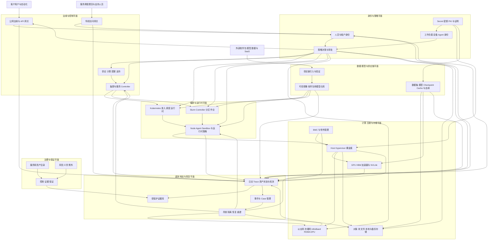

# NeoCloud Cyber Security 参考架构

**版本：** 1.0.0-draft.2  
**读者：** 安全架构、平台工程、网络、SRE、身份、数据/AI、基础设施和保证团队

## 1. 架构目标

本参考架构把白皮书原则转换为可分解的安全能力、信任区、决策点、执行点、证据流和恢复边界。它不绑定特定厂商；不同 NeoCloud 可以采用不同组件，但必须保持同样的安全不变量和可证明结果。将逻辑组件解释为具体产品或硬件保证前，应先阅读[范围与局限](SCOPE_AND_LIMITATIONS.md)。

架构基于以下现实：

- 类公有云 API 与 Kubernetes、Slurm/HPC、裸金属自动化及物理加速器互联同时存在；
- 一个租户请求要经过多个 Controller 和对象表达后才会真正运行；
- 基础设施、工作负载、数据/模型和 Agent 身份必须始终可以关联；
- 租户隔离是完整路径属性，而不是单个 VLAN、Namespace 或 GPU 配置属性；
- 管理员和自动化行为可能与恶意工作负载流量同样危险；
- 证据平面需要具备与风险相匹配的管理和观察独立性；这是逻辑信任要求，并不总是要求单独物理基础设施。

## 2. 逻辑架构

图中表示逻辑权限关系，并不建议把全部运行时执行集中到一个服务。策略执行点应靠近资源，避免中央服务故障后静默 Fail Open；策略、身份、资产和证据则应使用稳定标识，使一个 API 请求可以贯穿调度、Host/GPU/Fabric 分配、数据访问、结果输出和删除全过程。

## 3. 七个安全平面

### 3.1 治理与保证平面

**目的：** 决定保护什么、谁负责、适用哪些义务、接受何种风险，以及控制是否仍有当前证据。

最低能力：产品与安全服务目录；资产/身份/依赖/数据流图；控制目录与服务画像适用性；法规/合同/客户承诺登记；有到期时间的风险与例外流程；证据新鲜度与完整性；独立验证和保证材料；安全路线图、Owner 与资源决策。

该平面是决策上下文的系统记录，不一定保存每条技术事件。它必须区分 `IMPLEMENTED` 与 `VERIFIED`，并避免过期证据或例外仍显示为健康。

### 3.2 身份与策略平面

**目的：** 为每个关键决定建立主体、资源、动作、目的和上下文。

主体包括服务商员工、客户用户、租户组织、支持角色、服务账户、工作负载、节点、设备、Controller、构建系统、AI Agent 和安全自动化。

最低能力：

- 企业与客户联邦、抗钓鱼 MFA 和生命周期自动化；
- PAM、JIT/JEA 与 Break-glass；
- 使用短期工作负载身份替代嵌入式 Secret，并在产品支持且威胁模型证明必要时绑定 Attestation；
- 在技术可行时为 Node/BMC/DPU 建立设备身份；
- 独立 Agent 身份和明确委托链；
- 集中策略编写/决策和分布式执行；
- Tenant、Service、Environment、Data Class、Region、Device State、Isolation SKU、Ticket/Purpose 和 Risk 等属性；
- 对破坏性、客户影响、外部、高成本或不可逆行为进行审批；
- Secret、Key、Certificate、Signing 和 Attestation 的集中生命周期。

一次策略决定应可以解释为：

`主体 + 委托链 + 动作 + 资源 + 租户 + 目的 + 上下文 + 策略版本 → 允许/拒绝/审批 + 附加义务`

附加义务可能要求日志、脱敏、双人审批、限制出网、独占放置、会话记录、限流、数据驻留或事后验证。

### 3.3 边缘与控制平面

**目的：** 在不暴露服务商管理面、不发生租户混淆的前提下提供客户服务。

最低能力：DDoS、WAF/API Gateway、Schema/Payload 校验；每个 API 和 Controller 跳点的对象级租户授权；Request ID、幂等、防重放、配额与限流；私有服务商管理面和独立治理的支持路径；对供应、配额、计费、放置和网络/Fabric 分配进行签名或 Review；控制面身份与 Secret 和租户工作负载隔离；高可用 Controller、安全备份与重建；记录意图、决策、期望状态、实际状态和协调错误。

内部 Controller 不能因为“在内网”就被默认信任。API Object、数据库记录、Kubernetes Resource、Slurm State 和基础设施 Controller 之间的每次转换都必须保持租户和授权上下文。

### 3.4 编排与运行时平面

**目的：** 把经过批准的意图安全转换为实际 Job 和 Service。

Kubernetes 范围包括 API Server、etcd、Controller Manager、Scheduler、Admission、RBAC、Namespace、Network Policy、Pod Security Standards、Runtime、CNI/CSI、Device Plugin 和 Operator。Slurm 范围包括 Controller、Database、REST API、Authentication、Partition、Account、QOS、Prolog/Epilog、Module、Shared Storage、Compute Daemon 和 Job Accounting。

最低能力：服务商专用 Controller/Database 保持私有；面向客户的 API Endpoint 默认私有，或经过显式批准并实施强认证、访问限制、抗滥用和完整审计；分离服务商与租户权限；默认拒绝特权、Host、Device 和 Network 访问；不可变或严格管理的节点镜像；签名且通过策略的工作负载制品；Namespace/Queue/Account 配额和放置约束；运行时检测与快速 Node 隔离；可靠清理、凭据吊销和制品处理；控制面备份、恢复和已知可信重建。

### 3.5 计算、互联与存储平面

**目的：** 在数据真正处理和移动的位置执行物理与逻辑租户边界。

计算能力包括 Secure/Measured Boot、可信镜像、Host 加固、Hypervisor/Container 隔离、Device Assignment、GPU Partition/Dedication、显存重置、本地盘清除、故障域隔离和放置记录。

互联能力包括公网、租户、存储、集群、迁移、管理和 OOB 平面明确分离；VRF/VPC/VLAN/VXLAN；InfiniBand P_Key/Partition；RDMA；DPU/NIC Policy；NVLink 域感知；网络遥测与端到端连通性测试。

存储能力包括租户级授权、加密和密钥分离、Snapshot/Clone 控制、生命周期/保留、删除验证、不可变备份、恢复测试和租户安全的元数据/日志。

BMC/OOB 必须与租户网络和普通办公网隔离，实施强认证、补丁和监控，只能通过特权流程访问。BMC 或 Fabric Controller 失陷属于服务商信任根或全局影响事件，具体范围取决于实际权限与拓扑。

### 3.6 数据、模型与供应链平面

**目的：** 确保每个可执行或高价值制品都有已知来源、授权处理、完整性与生命周期。

最低能力：批准源/依赖策略；隔离构建、受保护签名身份以及 Root/高影响组件双人发布；镜像、Package、Operator、Driver、Firmware 和 IaC Bundle 的 SBOM、Provenance、Signature、Vulnerability/VEX；Model、Checkpoint、Adapter、Dataset、Prompt、Skill 和 Policy Inventory；安全格式与受限反序列化；Malware、Secret、License、Integrity 和 Policy 扫描；可信 Registry 和 Admission-time Verification；Source/Data 到 Build/Train/Evaluate/Release/Deploy 的血缘；Recall/Quarantine/Revoke/Rollback；隐私、驻留、保留与删除。

签名只能证明某个 Key 签过制品，并不能单独证明制品安全；真正信任来自 Source、Build、Review、Key Custody、Transparency、Policy 和 Validation 的组合。

### 3.7 遥测、响应与恢复平面

**目的：** 可靠理解状态、发现重大偏离、协调响应并恢复信任。

最低遥测覆盖身份、策略决定、API/控制面、支持访问、Kubernetes/Slurm Audit、Host/Runtime、GPU Allocation/Reset/Error、Fabric/DPU/BMC 变更、Storage/Data/Model Access、Registry/Build/Signing、Vulnerability、Egress、Abuse、Backup/Restore、Agent Tool Call 和 Verifier Outcome。

该平面必须提供：Tenant/Subject/Workload/Node/GPU/Fabric/Data/Model/Request 的统一 ID；时间同步与受保护传输/存储；租户安全访问和脱敏；关键事件不可变或可检测篡改；覆盖率与新鲜度监控；映射 ATT&CK/ATLAS 的检测；事件指挥/证据保全/通知；确定性吊销与隔离；可信恢复/重建和独立开服检查。

## 4. 信任区

生产设计至少显式建模以下区域：

1. **公网/非可信区：** Internet、匿名用户、外部 Webhook 和未验证内容。
2. **客户管理区：** 已认证租户 Console/API、客户联邦与租户管理员。
3. **服务商控制区：** 供应、编排、计费、支持、策略与内部服务控制面。
4. **特权管理区：** 管理工作站/网关、Break-glass 和高风险维护。
5. **租户工作负载/数据区：** VM、Container、Job、Model Endpoint、Data 和应用 Secret。
6. **Host/集群基础设施区：** Node、Hypervisor、Runtime、Cluster Service、Device Plugin、本地存储。
7. **高性能互联区：** Ethernet Cluster、Storage Fabric、InfiniBand/RDMA、NVLink Domain 和 DPU。
8. **带外/物理区：** BMC、Rack Management、Firmware Tool、Console Server 和 Facility。
9. **构建与制品信任区：** Source、CI/Build、Registry、Signing、Provenance 和 Release。
10. **安全证据与恢复区：** Log、Evidence、Backup、Incident System 和已知可信重建源。
11. **外部依赖区：** IdP/SaaS、Supplier、Package、Model/Data Source 和 Support Service。

区域间流量永不自动可信。每次跨区都要求已认证 Endpoint Identity，或在协议允许时使用权威 Identity-to-Resource Binding，并具备允许目的、显式策略、适当的传输保护、日志和经过测试的失败行为。底层物理或 L2 路径不能被假定会携带应用层 Tenant ID。

## 5. 架构不变量

设计评审必须逐项回答：

1. 每个控制面 Object/Message Boundary 都携带并验证 Tenant/Authorization Context，并通过权威绑定在 Storage、Compute、Accelerator 与 Fabric Resource 上执行。
2. 服务商管理接口不能从公网或租户 Data Plane 直接到达，必须经过治理后的特权路径。
3. 客户工作负载无法获得控制面、Node、BMC、DPU、Fabric Manager 或 Signing Credential。
4. 每种 SKU 明确声明 Compute/GPU/Fabric/Storage 隔离性质与局限。
5. 敏感多租户 SKU 不使用缺乏所需内存和故障隔离的共享方式。
6. Tenant 分配切换时，加速器、本地盘、Network/Fabric 和 Credential State 均被清除或重新供应并有证据。
7. Desired-state Controller 持续检查 Tenant、Network、P_Key、Device、Quota 和 Placement 错配。
8. 制品必须经过来源与策略验证才能执行；紧急绕过必须显式、到期且审计。
9. Source System 普通管理员无法在不被发现的情况下修改关键证据。
10. Identity、Key 和 Policy 可在不等待正常发布周期的情况下吊销。
11. 恢复使用已知可信源，并在流量恢复前验证租户隔离和完整性。
12. AI Agent/安全自动化不能自行扩大 Authorization Envelope、Tool、Credential、Approval Authority 或 Verifier；Goal/Task 变化必须经过独立授权的状态转换。

## 6. 核心安全流程

### 6.1 租户接入与身份

创建唯一组织和不可变 Tenant ID；根据服务风险验证业务身份；配置 Federation、抗钓鱼 MFA、Owner Role 和 Emergency Contact；应用默认 Quota、Egress、Region 和 Service Profile；生成责任/数据处理设置；在生产前测试 Access Removal、Emergency Contact 和 Log/Export。

### 6.2 资源供应

API 认证主体与租户并验证 Schema/Quota；策略评估 Resource、Isolation SKU、Region、Data Class、Cost 和 Risk；Provisioner 创建不可变 Request/Correlation ID；Controller 使用 Tenant Label 分配 Network/Fabric/Storage/Host/GPU；独立协调器对比实际分配与策略/拓扑；证据记录 Decision、Artifact Version、Resource ID、Isolation Mode 和 Result。

租户上下文缺失或冲突时必须 Fail Closed。部分失败应回滚或隔离，不能停留在含糊的“基本供应完成”状态。

### 6.3 工作负载/作业执行

工作负载获得短期、服务专用身份；Admission 验证 Image/Model Provenance、Privilege、Device、Mount、Network 和 Data Access；Scheduler 执行 Tenant/Queue/Namespace、Quota 和 Placement；Node Agent 执行前再次校验；Runtime/GPU/Fabric/Storage Event 均关联 Job Identity；结束时吊销凭据、处理 Output、Cleanup、Reset 并生成证据。

### 6.4 Agent 工具执行

Agent 具有明确 Goal、不可静默修改的 Scope、身份和 Delegation Chain；外部内容只作为 Observation；Tool Request 使用 Typed Schema，并针对 Action/Resource/Tenant/Data/Cost 做策略；高影响行为需要确定性审批，不能由模型自我批准；Action/Observation/Evidence 写入抗篡改 Trace；Stop Condition 覆盖 Success、Budget、Time、Repeated Failure、Policy Violation 和 Uncertainty；独立 Verifier 验证证据后才能进入 `VERIFIED`。

### 6.5 服务商支持访问

客户请求或事件建立 Purpose 和 Case ID；JIT 只授权最小 Service/Tenant/Resource；高风险访问经过加固路径、Session/Command Audit，必要时双人控制；避免或掩码客户数据；Access 自动到期并与 Ticket 结果复核。

### 6.6 事件隔离与重新开服

建立 Incident Command 并通过稳定 ID 确认范围；保全证据并在最强可靠边界隔离；按爆炸半径吊销人员/工作负载/Agent Identity 与 Key；按需隔离 Artifact、Node、GPU、Fabric Segment、Data 或 Tenant；从 Trusted Source 重建，不对不可信 Root 做“清理”；独立验证 Tenant Isolation、Artifact Integrity、Key State、Logging 和 Customer Impact；基于证据明确决策开服，而不是因为“暂时没告警”。

## 7. 策略架构

可扩展策略系统应分离：

- **PAP：** 经过 Review 和版本化的策略源；
- **PIP：** 来自 Identity、Asset、Data、Tenant、Risk、Ticket、Isolation 和 Threat System 的可信属性；
- **PDP：** 确定性授权与附加义务决策；
- **PEP：** API Gateway、Orchestrator、Admission、Scheduler、Node、Fabric、Storage、KMS、Registry 或 Agent Tool Broker；
- **Evidence Sink：** 记录身份/上下文、策略版本、Decision、Obligation、Enforcement 和 Result。

策略必须具备 Unit/Negative Test、Change Review、Staged Rollout、Rollback、Decision Explainability、HA 和 Stale Attribute Behavior。权限与租户边界通常应 Fail Closed；生命安全或恢复路径则需要精心设计的 Break-glass，而不是机械拒绝。

## 8. 服务画像模式

### GPU IaaS

实施强 VM/Container 隔离；区分 Full-GPU Dedication、Hardware Partition、Hypervisor-mediated vGPU 与 Scheduler-level Sharing；隔离设备管理；针对具体 Product/Version/Configuration 验证 Memory、Fault、Reset、Performance Interference 与 Cleanup；提供 Tenant Network/Storage Control；保留 Allocation Topology 和 Host/GPU Lineage。

### 裸金属 GPU

把 Provision/Deprovision 视为安全仪式：验证 Firmware/Config，隔离 BMC/OOB，分配专属 Network/Fabric，移除 Provider Credential，清除 Storage/Device State，并证明交付前后状态。

### 托管 Kubernetes

分离 Provider Control 与 Tenant Namespace；默认 Restricted Admission；控制 Privileged/Host/Device Access；隔离 CNI/CSI/Device Plugin；使用 Workload Identity；保护 etcd/Backup；持续验证 RBAC 与 Network Policy。

### 托管 Slurm/HPC

保护 Controller/Database/REST/Auth；治理 Account、Partition、QOS、Association 以及采用时的 MCS；保护 Prolog/Epilog 与 Module；隔离 Shared Storage/Fabric；阻止普通用户改变 Controller State；收集 Job/Accounting 和高权限证据。Slurm Scheduling Label 与 MCS 不能替代 OS/Runtime、Credential、Storage 和 Network/Fabric Isolation。

### 模型训练与服务

使用 Workload Identity 绑定 Data/Model/Checkpoint；记录 Lineage；安全加载；隔离 Cache/Temp Data；控制 Model Export；保护 Endpoint Authorization、Routing 和 Quota；在不泄露租户内容的情况下发现异常提取和滥用。

### Agent 平台

所有 Tool 通过 Policy Broker；区分 Observation 与 Instruction；Connector 权限受限并使用短期 Credential；客户影响、破坏性、外部或不可逆行为需要 Approval；记录 Trace；提供确定性 Cancel、Cost Limit 和 Independent Verification。

### 主权/监管画像

把 Data、Key、Telemetry、Admin、Support 和 Recovery Source 限定在批准边界；验证 Supplier/Subprocessor 和 Remote Access；运行 Region-specific Root 或受控 Key Release；产生符合司法辖区的证据和通知流程。

## 9. 韧性与降级模式

Identity、Policy、KMS、Telemetry、Scheduler、Fabric Controller 和 Registry 故障时，必须明确：新 Session/Job/Resource 是拒绝、排队还是使用有限缓存；Cache Lifetime、Revocation Propagation 和 Stale Risk；Emergency Authority 与 Dual Control；本地证据缓冲与恢复后对账；恢复顺序和依赖图；客户沟通/SLA；证明降级模式不会导致租户隔离坍塌的测试。

不要构建一个中央安全服务，使其故障后要么平台无限期停摆，要么所有执行点全部 Fail Open。

## 10. 架构验证清单

上线前及重大变更后独立验证：

- Service Profile、Responsibility 和 Trust Zone Diagram 当前有效；
- Public、Tenant、Provider、Privileged、Fabric 和 OOB Path 符合策略；
- Tenant ID/Workload Identity 在每个 Controller Transition 后保持；
- Negative Authorization/Cross-tenant Test 正确失败；
- GPU Sharing/Reset 和 Fabric Assignment 满足声明；
- Artifact Admission 拒绝 unsigned/untrusted/revoked/incompatible 输入；
- Evidence ID、Time、Integrity 和 Freshness 完整；
- Privileged/Agent Action 触发预期 Approval/Stop；
- Identity/Key Revocation 和 Incident Containment 达到目标；
- Restore/Rebuild/Secure Deletion 有实测证明，而不仅是文档。

架构批准必须有有效期。Service SKU、Orchestrator、GPU Sharing、Fabric Topology、Identity、Key Hierarchy、Data Flow、Supplier、Model/Agent Capability 或 Recovery Design 发生重大变化时必须重新评审。
